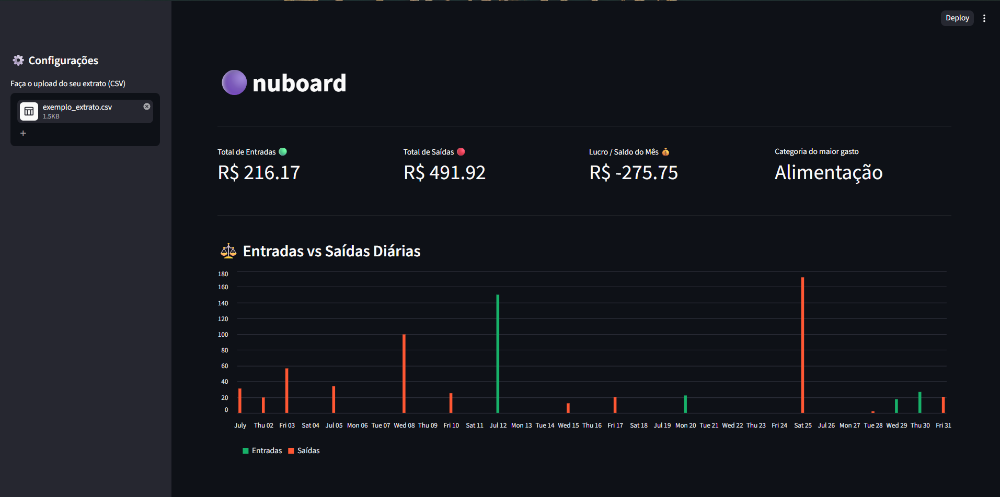
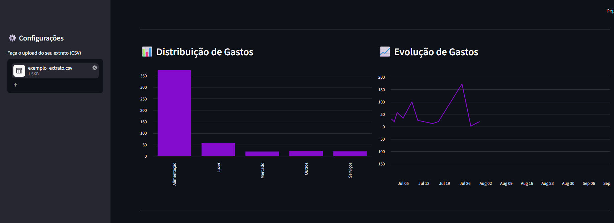

# 🟣 Nuboard (Dashboard Financeiro)

Uma aplicação full-stack de análise de dados financeiros desenvolvida para processar, categorizar e visualizar transações de faturas da conta nubank. Este projeto demonstra a construção de um pipeline de ETL (Extract, Transform, Load) integrado a um dashboard interativo.

## 🚀 Arquitetura e Tecnologias

O projeto foi construído utilizando Python e foca em processamento eficiente de dados e usabilidade na interface:

*   **Frontend / UI:** Streamlit
*   **Processamento de Dados (Motor ETL):** Pandas
*   **Análise de Frequência (NLP básico):** Regex, Collections

## ⚙️ Funcionalidades

*   **Upload Dinâmico:** Interface lateral para upload de arquivos `.csv` do extrato Nubank, permitindo análise em tempo real sem alterar o código.
*   **Pipeline de Limpeza e Transformação:** Tratamento automatizado de datas, conversão de tipagem de moedas e padronização de descrições.
*   **Motor de Categorização Baseado em Regras:** Sistema de classificação que varre as descrições das compras e as rotula (ex: Alimentação, Transporte, Investimentos) com base em um mapeamento pré-definido.
*   **Visualização de Dados:** KPIs financeiros (lucro/saldo, maior gasto), gráficos comparativos de entradas vs. saídas e evolução de gastos diários.

## 📂 Estrutura do Projeto

*   `app.py`: Interface de usuário (frontend) construída com Streamlit, contendo as lógicas de renderização de gráficos e KPIs.
*   `etl.py`: Backend do projeto. Responsável por ler o CSV, aplicar as transformações com Pandas e rodar o algoritmo de categorização.

## 🛠️ Como executar o projeto localmente

1. Clone o repositório:
```bash
git clone https://github.com/murilopetegrossoperes/nuboard.git
```
2.Instale as dependências:
```
pip install -r requirements.txt
```
3.Execute o dashboard:
```
streamlit run app.py
```
1.  **Visão Geral do Dashboard:**



2.  **Detalhamento Analítico:**


